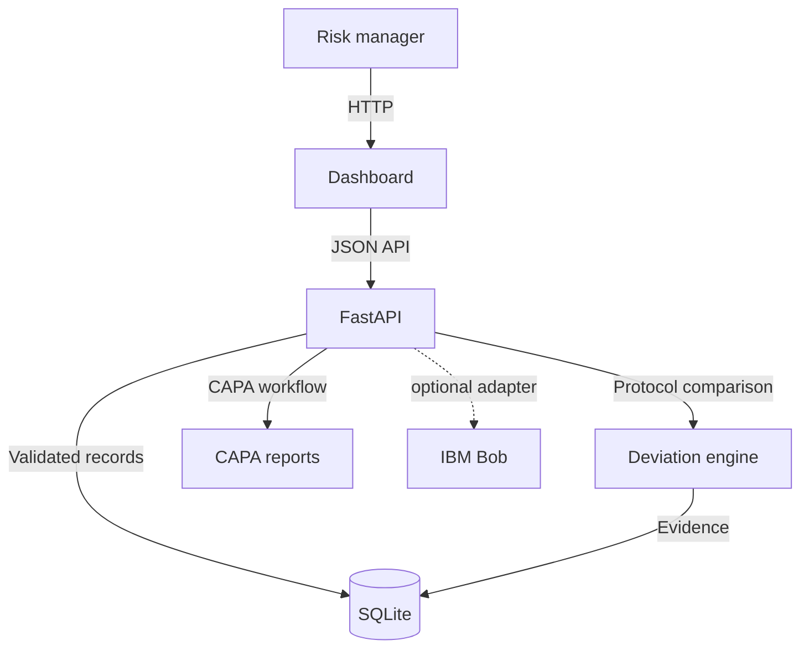

# Architecture

## System Architecture

TrialGuard uses a browser client, a small FastAPI application, and a local SQLite repository. The protocol engine and risk calculation run on the server so the browser never becomes the source of truth for a classification.

## Components

| Component | Technology | Responsibility |
|---|---|---|
| Frontend | HTML, CSS, JavaScript | Dashboard UI, imports, filters, and CAPA actions |
| Backend API | FastAPI, Uvicorn | Validation, orchestration, and HTTP contract |
| Protocol engine | Python | Visit, dose, medication, assessment, and timeliness checks |
| Risk engine | Python | Severity-weighted site score and risk category |
| Database | SQLite | Source records, findings, scores, and CAPA reports |
| Optional assistant | IBM Bob adapter boundary | Grounded investigation questions when configured |

## Data Flow

1. A local JSON payload is submitted to `POST /api/import`.
2. The API resolves site, patient, and visit relationships before writing SQLite records.
3. `POST /api/analyze` clears derived deviations, evaluates source records, and updates site scores.
4. The dashboard reads summary, site, deviation, investigation, and CAPA endpoints.
5. CAPA actions are stored with their source deviation, owner, due date, and status.

## Security Considerations

- Only de-identified development data should be used until authentication is added.
- Secrets are environment variables and `.env` is ignored by Git.
- SQLite remains local; a deployment must add access controls, encryption at rest, backups, audit logging, and a managed secret store.

## Scalability Notes

The repository boundary isolates database access so SQLite can be replaced with a managed relational database for deployment. Analysis can run as a queued job for large imports, while the API remains stateless and an optional Bob adapter can be rate-limited independently.
