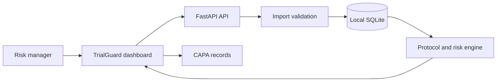

# Solution Overview

## What We Built

TrialGuard is a local-first monitoring application. A team imports structured, de-identified trial records, evaluates them against protocol rules, and runs an analysis. The application stores each finding with the rule and source values that caused it, ranks sites by risk, and lets an investigator create a CAPA record linked to the finding.

## How It Works

1. The user imports sites, patients, visits, doses, medications, and assessments as JSON.
2. The API validates relationships and stores the records in local SQLite.
3. The analysis engine compares records with the protocol and creates evidence-backed deviations.
4. The risk engine aggregates severity-weighted findings into site scores and risk levels.
5. The investigator opens a grounded site brief or generates a persisted CAPA report.

## Architecture Diagram

## Key Design Decisions

| Decision | Rationale |
|---|---|
| Deterministic protocol rules | Clinical findings need a traceable rule and evidence trail. |
| Local SQLite repository | The application is runnable offline with no database service dependency. |
| Evidence brief separated from classification | Reviewers can distinguish stored facts from generated recommendations. |
| JSON import contract | Existing EDC exports can be transformed without coupling the API to one vendor. |

## IBM Technologies

The application has an adapter boundary for IBM Bob. It receives a selected site or deviation context and can return grounded investigation questions or CAPA drafts when the organizer-provided Bob interface and credentials are configured. Until then, the running application does not fabricate an AI response: its evidence brief is generated from SQLite facts only.
